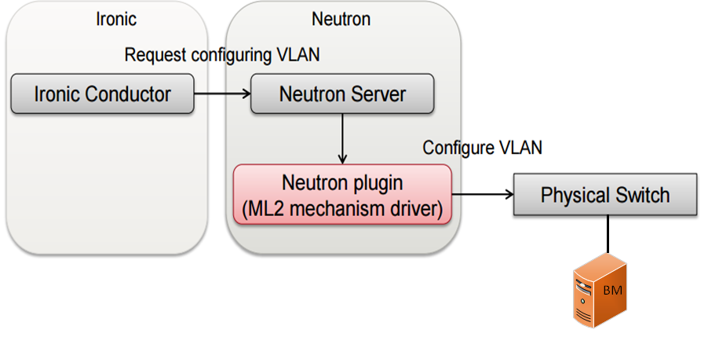

========
Overview
========
.. _whatisbnp:

1. What is Networking HPE (NHPE)
================================

Openstack Ironic project deals with provisioning BM servers. However, plumbing of BM servers into tenant networks has been a manual procedure by the Cloud Admin .Within the timeframe of Liberty/Mitaka release of Openstack, we are attempting to spruce-up ironic to automate plumbing BM servers into tenant networks. Since Openstack Neutron project deals with plumbing ports on tenant-network in the cloud, Ironic has requested the Neutron team to provide enhancement to enable plumb the BM server ports into Cloud infrastructure (part of solution).Initially, Openstack Neutron will be extended to allow plumbing of BM server ports into only VLAN-based networks. These networks could either be a boot up network (ie., PXE booting network for BM servers) , or tenant network (for cloud to BM server communication) or cleaning-network (for recovering BM server used IP namespaces).

To support this neutron has added new vnic_type as 'baremetal' and ironic supplied the link_local_information in the binding:profile dict of port .

.. _model:
2. NHPE models
==============
NHPE introduces various models to describe the relationship between neutron ports and the physical ports.

.. _cli:
3. NHPE CLI's
=============

Create Switch:

neutron-bnp switch-create $switch_ip  $vendor_name  $protocol --access_parameters write_community=$community_string

Show Switch:

neutron-bnp switch-show <switch_id>

List Switch:

neutron-bnp switch-list

Delete switch:
This happens in 2 steps:
a.	Disable the switch:  neutron-bnp switch-update <switch_id> --enable=False
b.	Delete the switch: neutron-bnp switch-delete <switch_id>

Update Switch:

neutron-bnp switch-update $switch_id  --enable False --rediscover True
neutron-bnp switch-update $switch_id   --rediscover True

.. _deployment:
4. Deployment Components
========================

.. _enablement:
5. Enable NHPE code in devstack
===============================
Refer the below link
https://github.com/hp-networking/baremetal-network-provisioning/blob/master/devstack/README.rst

.. _mechanism_driver:
6. Mechanism Driver Actions
===========================

Mechanism driver is listening for PortContext events from the ML2 Plugin .
Implemented create_port_precommit(), update_port_precommit(), delete_port_precommit() & bind_port()
only bind_port() calls make the SNMP request to the switch.

when ironic invokes the neutron port-create calls to the neutron then mechanism driver takes the action accordingly.
The mechanism driver acts based on VNIC_TYPE =='baremetal' and process the neutron ports.

The physical information like switch_id and port_id is fetched from the 'local_link_information' list from portbindings.PROFILE

.. _supported_switches:
7. Supported Switches
===========================
The following switches are supported in this project
5900, 5920, 5930, 5700, 7900

.. _references:
8. References
=============
https://specs.openstack.org/openstack/ironic-specs/specs/not-implemented/network-provider.html
https://specs.openstack.org/openstack/ironic-specs/specs/not-implemented/ironic-ml2-integration.html

